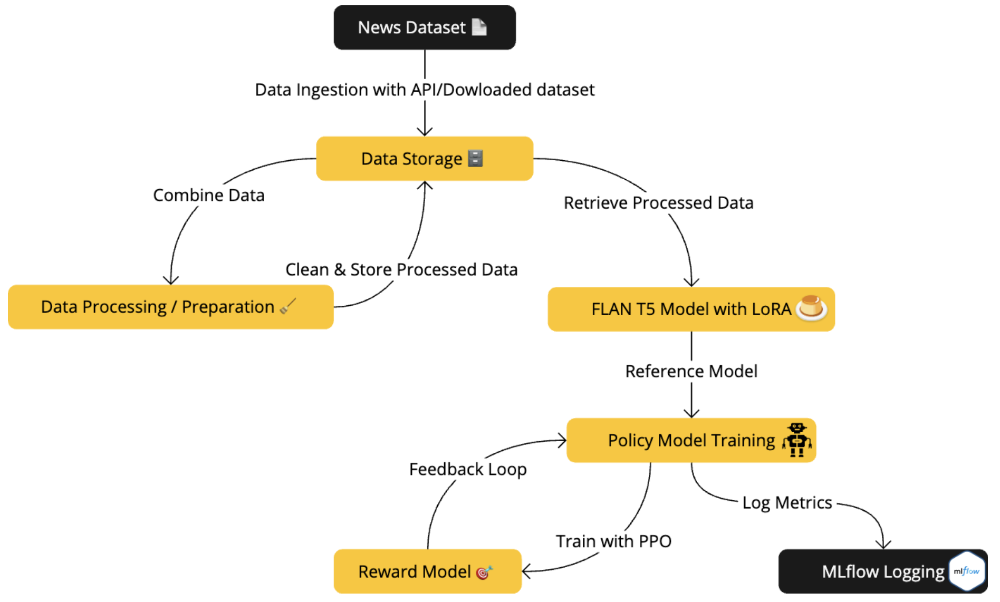

# Enhancing Title Generation in LLMs Using Reinforcement Learning

This project aims to advance title generation by integrating Large Language Models (LLMs) with Reinforcement Learning (RL). Traditional fine-tuning methods for LLMs, such as GPT-3 and GPT-4, often yield titles that may seem predictable or lack creative flair. This project explores how RL enables LLMs to produce more engaging, human-like titles by incorporating continuous feedback and adapting dynamically to specific contexts. By training on data from news APIs, our model learns to respond intelligently to themes like AI, 5G, and COVID-19, resulting in a more sophisticated and context-aware title generator.

## Project Overview

This project leverages a combination of state-of-the-art machine learning techniques to enhance title generation. Using a pipeline-based approach, we process news data, train models, and apply a feedback loop for continuous improvement. Key components include data collection, preprocessing, model training with LoRA and PPO, reward model evaluation, and MLflow logging for performance tracking.

## Methodology



The methodology follows a structured pipeline with the following steps:

### 1. Data Collection and Storage
   - **Data Source**: Article data is collected from [GNEWS](https://gnews.io/) API, focusing on curated themes.
   - **Storage Format**: The data is stored in JSON files, allowing structured and easy access in subsequent stages.

### 2. Data Processing
   - After initial storage, data undergoes rigorous cleaning and is split into training and testing sets. This ensures that the model learns from high-quality data and allows for reliable evaluation of model performance.

### 3. Policy Model Training
   - **Model**: We use the FLAN T5 model, fine-tuning it with LoRA (Low-Rank Adaptation) and optimizing it with PPO (Proximal Policy Optimization).
   - **Objective**: LoRA enables parameter-efficient adaptation, while PPO helps refine the model's response by updating its policies based on reward signals. This combination is effective for nuanced tasks like title generation, allowing the model to adapt and evolve continuously.

### 4. Reward Model and Feedback Loop
   - **Reward Model**: Using `roberta-base-openai-detector`, we assess the quality of outputs from the policy model.
   - **Feedback Mechanism**: The reward model’s feedback is integral to the RL loop, where the model learns from both positive and corrective feedback. This RLHF (Reinforcement Learning from Human Feedback) approach allows for a more iterative training process, yielding more refined and human-like outputs.

### 5. MLflow Logging and Tracking
   - Throughout the training cycle, [MLflow](https://mlflow.org/) logs various metrics and tracks model performance. We log the “humanity score” predicted by the reward model, along with other NLP-based metrics, to identify the best-performing model checkpoints for our use case.

## Directory Structure

```plaintext
├── data/
│   ├── logs/                        # Logs of the data processing pipeline
│   ├── preprocessed/                # Preprocessed data files
│   └── raw/
│       ├── all_articles.json        # Raw data file with all fetched articles
│       └── pipeline_log.json        # Log file for tracking pipeline execution
├── scripts/
│   ├── __init__.py
│   ├── model_train.py               # Main script for training the model
│   └── prepare_dataset.py           # Script for dataset preparation and splitting
├── utils/
│   ├── common/
│   │   ├── __init__.py
│   │   ├── constants.py             # Project constants
│   │   └── helper_funcs.py          # Helper functions used across modules
│   ├── data_prep/
│   │   ├── __init__.py
│   │   ├── data_ingestion.py        # Script for fetching data from GNEWS
│   │   ├── data_preprocessing.py    # Script for data cleaning and formatting
│   │   └── data_storage.py          # Script for storing and managing data files
│   └── model_training/
│       ├── __init__.py
│       ├── metrics.py               # Script for defining and computing metrics
│       └── model_train_utils.py     # Utility functions for model training
├── .env                             # Environment variables (API keys, etc.)
├── .gitignore                       # Ignored files and directories
├── methodology.png                  # Methodology image
└── README.md                        # Project overview and methodology
```
## Setup and Installation

Clone this repository:

```bash
git clone https://github.com/ramendrasingla/RL-LLM-Based-Title-Generator.git
```

Install the required dependencies:

```bash
pip install -r requirements.txt
```
Set up the necessary API keys in the .env file for data collection from the GNEWS API and configure your MLflow server.

## Running the Project

1. **Dataset Preparation**: Use `prepare_dataset.py` in `scripts` to split the data into training and testing sets.
2. **Model Training**: Execute `model_train.py` in `scripts` to train the FLAN T5 model with LoRA and PPO.

## Contributing

Contributions are welcome! Please open an issue or submit a pull request for any enhancements or bug fixes.

